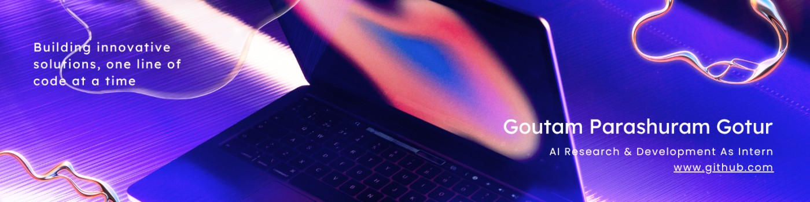

Mᴀᴄʜɪɴᴇ Lᴇᴀʀɴɪɴɢ | Dᴇᴇᴘ Lᴇᴀʀɴɪɴɢ | ML webapps with ꜰᴀʟᴄᴏɴ & ꜰᴀꜱᴛAPI | Tᴇɴꜱᴏʀғʟᴏᴡ || 【P】【y】【t】【h】【o】【n】

## About :
  I am a 2nd Year undergraduate student at <a href="https://theoxford.edu/engineering/"><b>The Oxford College of Engineering, Affiliated to VTU</b></a>, Bengaluru. From early on, I found myself quietly drawn to the world of technology—its logic, its mystery, and its power to shape stories. This love has helped me cultivate a thoughtful engineering mindset , blending curiosity with creativity. I believe that every insight is a stepping stone, and no amount of knowledge  is ever truly enough.

## Ask me about : Computer: 
- **Competitive Programming**
	- Python ❤️
	- C++
	- Some Java

- **Web Development**
	- HTML, CSS and Javascript :white_check_mark:
	- Bootstrap
	- React :electron:
	- PostgreSQL
  - NodeJS  
- **Shell Scripting**

<code></code>
<code></code>
<code></code>
<code></code>
  

## Tech stack

**Languages & Libraries**

<code></code>
<code></code>
<code></code>
<code></code>
<code></code>

**Databases**

<code></code>
<code></code>

**Frameworks & Tools**

<code></code>
<code></code>
<code></code>
<code></code>

***

## 🌱 I’m currently learning ...
- **GEN AI**
- **AI & ML**
 
   

***

 

## My achievements

<!-- 

 -->

## 1 day, 1 commit

<!-- ### Recently I'm coding in...

 -->

  <h3 align="center">Connect with me</h3> 

## Links: 

 <a href="https://www.linkedin.com/in/goutam-parashuram-gotur/" target="blank">
   &nbsp; &nbsp;
 </a>
 <!-- <a href="https://www.instagram.com/cyber_freak_21/" target="blank">
   &nbsp; &nbsp;
 </a> -->
 <a href="https://x.com/goutampgotur" target="blank">
   &nbsp; &nbsp;
 </a>
   
   

  <b>Thank you for wandering through my digital garden 🌱</b> 
  <em>May your ideas bloom, your code whisper gently, and your journey echo with quiet brilliance.</em> 🌌

*** 

 

Visit my profile and give a ⭐️ if you like it

⭐️ From [goutam-tech](https://github.com/goutam-tech)
